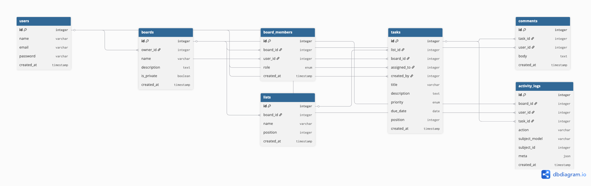

# 🗂️ Planico — Task Management REST API

A professional task management REST API built with **Laravel 13** and **MySQL**, inspired by tools like Trello. Planico allows teams to collaborate through boards, lists, and tasks with role-based access control.

---

## 🚀 Tech Stack

| Technology      | Version |
| --------------- | ------- |
| PHP             | 8.4.11  |
| Laravel         | 13.1.1  |
| MySQL           | Latest  |
| Laravel Sanctum | Latest  |

---

## ✨ Features

- 🔐 **Token-based Authentication** via Laravel Sanctum
- 📋 **Board Management** — Create and manage project boards
- 👥 **Team Collaboration** — Invite members with role-based access
- 📝 **Lists & Tasks** — Kanban-style task management
- 💬 **Comments** — Comment on tasks
- 📊 **Activity Log** — Track all actions on a board
- 🔒 **Role-Based Access Control** — Manager, Team Lead, Member
- 🌐 **RESTful API** — Follows REST principles
- ⚡ **Global Error Handling** — Consistent JSON error responses
- 📦 **API Resources** — Clean and consistent JSON responses

---

## 👥 Roles & Permissions

| Action              | Manager | Team Lead | Member |
| ------------------- | ------- | --------- | ------ |
| Create/Delete Board | ✅      | ❌        | ❌     |
| Invite Members      | ✅      | ❌        | ❌     |
| Change Member Roles | ✅      | ❌        | ❌     |
| Create/Delete Lists | ✅      | ✅        | ❌     |
| Create/Assign Tasks | ✅      | ✅        | ❌     |
| View Board & Tasks  | ✅      | ✅        | ✅     |
| Add Comments        | ✅      | ✅        | ✅     |
| Edit Own Comments   | ✅      | ✅        | ✅     |
| Delete Any Comment  | ✅      | ❌        | ❌     |

---

## 🗄️ Database Schema



---

## 📡 API Endpoints

### 🔐 Auth

| Method | Endpoint        | Description         | Auth |
| ------ | --------------- | ------------------- | ---- |
| POST   | `/api/register` | Register a new user | ❌   |
| POST   | `/api/login`    | Login and get token | ❌   |
| POST   | `/api/logout`   | Logout current user | ✅   |

### 📋 Boards

| Method | Endpoint              | Description     | Role    |
| ------ | --------------------- | --------------- | ------- |
| GET    | `/api/boards`         | List all boards | Member+ |
| POST   | `/api/boards`         | Create a board  | Auth    |
| GET    | `/api/boards/{board}` | View a board    | Member+ |
| PUT    | `/api/boards/{board}` | Update a board  | Manager |
| DELETE | `/api/boards/{board}` | Delete a board  | Manager |

### 👥 Members

| Method | Endpoint                               | Description   | Role    |
| ------ | -------------------------------------- | ------------- | ------- |
| GET    | `/api/boards/{board}/members`          | List members  | Member+ |
| POST   | `/api/boards/{board}/members`          | Invite member | Manager |
| GET    | `/api/boards/{board}/members/{member}` | View member   | Member+ |
| PUT    | `/api/boards/{board}/members/{member}` | Update role   | Manager |
| DELETE | `/api/boards/{board}/members/{member}` | Remove member | Manager |

### 📝 Lists

| Method | Endpoint                           | Description   | Role       |
| ------ | ---------------------------------- | ------------- | ---------- |
| GET    | `/api/boards/{board}/lists`        | Get all lists | Member+    |
| POST   | `/api/boards/{board}/lists`        | Create a list | Manager/TL |
| GET    | `/api/boards/{board}/lists/{list}` | View a list   | Member+    |
| PUT    | `/api/boards/{board}/lists/{list}` | Update a list | Manager/TL |
| DELETE | `/api/boards/{board}/lists/{list}` | Delete a list | Manager    |

### ✅ Tasks

| Method | Endpoint                                        | Description        | Role       |
| ------ | ----------------------------------------------- | ------------------ | ---------- |
| GET    | `/api/boards/{board}/lists/{list}/tasks`        | Get all tasks      | Member+    |
| POST   | `/api/boards/{board}/lists/{list}/tasks`        | Create a task      | Manager/TL |
| GET    | `/api/boards/{board}/lists/{list}/tasks/{task}` | View a task        | Member+    |
| PUT    | `/api/boards/{board}/lists/{list}/tasks/{task}` | Update a task      | Manager/TL |
| DELETE | `/api/boards/{board}/lists/{list}/tasks/{task}` | Delete a task      | Manager/TL |
| GET    | `/api/boards/{board}/tasks`                     | All tasks on board | Member+    |

### 💬 Comments

| Method | Endpoint                                                           | Description    | Role          |
| ------ | ------------------------------------------------------------------ | -------------- | ------------- |
| GET    | `/api/boards/{board}/lists/{list}/tasks/{task}/comments`           | Get comments   | Member+       |
| POST   | `/api/boards/{board}/lists/{list}/tasks/{task}/comments`           | Add comment    | Member+       |
| GET    | `/api/boards/{board}/lists/{list}/tasks/{task}/comments/{comment}` | View comment   | Member+       |
| PUT    | `/api/boards/{board}/lists/{list}/tasks/{task}/comments/{comment}` | Update comment | Owner         |
| DELETE | `/api/boards/{board}/lists/{list}/tasks/{task}/comments/{comment}` | Delete comment | Owner/Manager |

### 📊 Activity Log

| Method | Endpoint                       | Description        | Role    |
| ------ | ------------------------------ | ------------------ | ------- |
| GET    | `/api/boards/{board}/logs` | Get board activity | Member+ |

---

## ⚙️ Installation & Setup

### Prerequisites

- PHP >= 8.4
- Composer
- MySQL
- Laravel CLI

### Steps

**1. Clone the repository:**

```bash
git clone https://github.com/PrasadDa08/Planico.git
cd Planico
```

**2. Install dependencies:**

```bash
composer install
```

**3. Copy environment file:**

```bash
cp .env.example .env
```

**4. Configure your `.env` file:**

```env
DB_CONNECTION=mysql
DB_HOST=127.0.0.1
DB_PORT=3306
DB_DATABASE=planico
DB_USERNAME=root
DB_PASSWORD=your_password
```

**5. Generate application key:**

```bash
php artisan key:generate
```

**6. Run migrations:**

```bash
php artisan migrate
```

**7. Install Sanctum:**

```bash
php artisan install:api
```

**8. Start the server:**

```bash
php artisan serve
```

API will be available at `http://127.0.0.1:8000/api`

---

## 🔑 Authentication

Planico uses **Laravel Sanctum** for token-based authentication.

1. Register or login to get your token
2. Include the token in all authenticated requests:

```
Authorization: Bearer your_token_here
```

---

## 📮 API Documentation

Full API documentation with request/response examples is available on Postman:

👉 [View Postman Documentation](https://documenter.getpostman.com/view/53440734/2sBXionA9R)

---

## 📁 Project Structure

```
app/
├── Http/
│   ├── Controllers/Api/    # API Controllers
│   ├── Requests/           # Form Request Validation
│   └── Resources/          # API Resources
├── Models/                 # Eloquent Models
├── Policies/               # Authorization Policies
└── Services/               # Business Logic Services
    └── ActivityService.php # Activity Logging Service
```

---

## 🛡️ Error Handling

All errors return consistent JSON responses:

```json
{
    "status": false,
    "message": "Error description",
    "errors": {}
}
```

| Status Code | Description         |
| ----------- | ------------------- |
| `401`       | Unauthenticated     |
| `403`       | Unauthorized action |
| `404`       | Resource not found  |
| `422`       | Validation failed   |
| `500`       | Server error        |

---

## 👨‍💻 Author

**Prasad Datir**

- GitHub: [@PrasadDa08](https://github.com/PrasadDa08)

---

## 📄 License

This project is open-sourced under the [MIT License](LICENSE).
